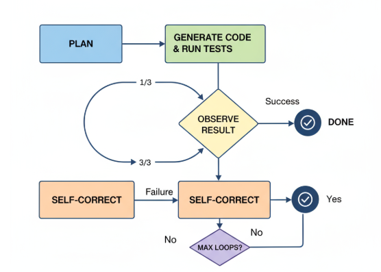

# ai-agent-challenge
Coding agent challenge which write custom parsers for Bank statement PDF.

## About the Project
This repository is my implementation of the **Agent-as-Coder** challenge.  
The goal was to build an **autonomous coding agent** that can **write its own parser** for bank-statement PDFs.  

## My Approach

### Clone and Setup
did git clone 
git clone https://github.com/Sushmithajn/ai-agent-challenge.git
cd ai-agent-challenge

## Create and activate virtual environment
python -m venv venv
venv\Scripts\activate

## .env used for API key
used .env for API keys 
Groq API key using (GROQ_API_KEY=yourAPIkey)

##Install dependencies
pip install -r requirements.txt

## data file formate
in data folder the file should named like this 
data/
├── icici/
│   ├── icici_sample.csv
│   └── icici_sample.pdf
└── sbi/
    ├── sbi_sample.csv
    └── sbi_sample.pdf

## Run the Agent
python agent.py --target icici
pytest -q tests/test_icici_parser.py

## Code run test
tested for icici bank statement pdf

## Agent Design

         
Plan → Generate code & run tests → Observe result → Self-correct (≤3) → (back to Plan)

## Screen Recording Demo
Demo link: https://drive.google.com/file/d/1dfF2wNQJDZlZSrRAk2TDBJlBOiqEGI-g/view?usp=sharing

